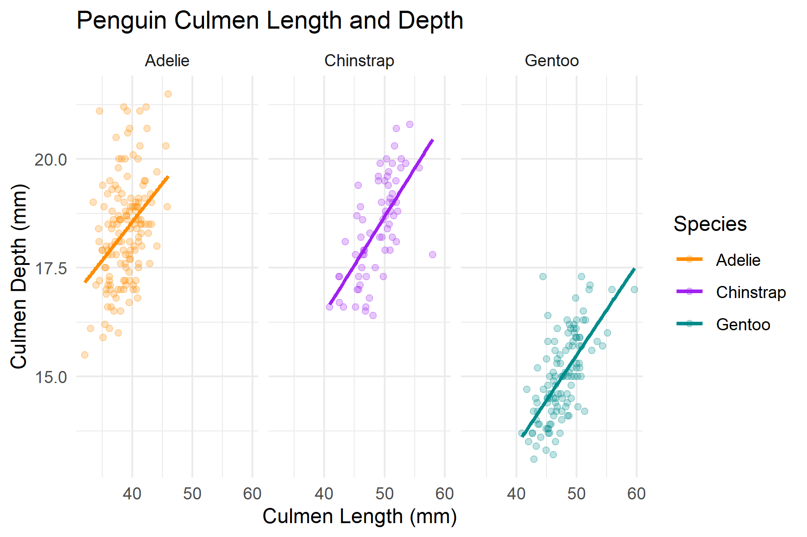
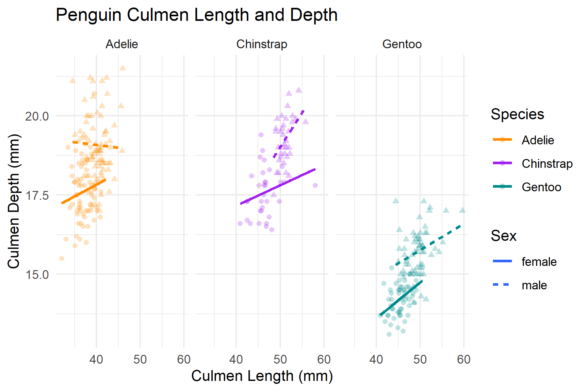

```{r setup, include = FALSE}
knitr::opts_chunk$set(echo = TRUE, comment = "")
library(palmerpenguins)
library(tidyverse)
theme_set(theme_light())  #you can set a universal theme for all of your visualizations here using either a pre-built theme, like theme_light() or by using theme() to set your own specifications
```


## Visualizing Penguins
For each situation, follow the instructions to create a visualization of the penguin data.


```{r}
data("penguins") #this loads the data from the palmerpenguins package
```


### Bill Length by Species
For each line of code, comment on what that line of code is doing to the visualization.   
**Hint:** Highlight from before the `%>%` pipe or the `+`to the beginning of the code sequence and use `Ctrl + Enter` to run just the highlighted lines of code. Or split the code into multiple code 

```{r}
penguins %>% 
  drop_na(bill_length_mm) %>% #drops missing values from bill length variable
  ggplot(aes(x = bill_length_mm)) +  #comment
  geom_density(aes(fill = species), alpha = 0.35) + #comment
  labs(title = "Penguin Culmen Length", #comment
       x = "Culmen Length (mm)", #comment
       y = "Number of Penguins", #comment
       fill = "Species") + #comment
  scale_fill_manual(values = c("darkorange","purple","cyan4")) #comment
```


### Bill Length and Depth for Penguins
For the following code, add to or modify the graph code below in the following ways:  

- Color the points by species types using the same color values as the previous graph for each species.  
- Add a straight line to model the relationship between bill depth and length by species. (Hint, consider "lm" for method)    
- Make the points more transparent so that the line stands out.  
- Add appropriate axis labels, legend labs, and titles to the graph.  
- Change the theme to "minimal"
- Facet the graph by species
- Have the figure print as 6 in wide, 4 in height

The final graph should look like  

    


```{r}
penguins %>% 
  drop_na() %>% 
  ggplot(aes(x = bill_length_mm, y = bill_depth_mm)) +
  geom_point() +
  geom_smooth(se = FALSE)
```


- Bonus: Add a different shape and line type for each sex.  The final should look like  

  


### Body Mass

Create a data visualization of boxplots to compare body mass by species and sex.  

- Color the boxplots by species (same colors as previous graphs)
- Add appropriate axis labels, legend labs, and titles to the graph.  
- Change the theme to "black and white"  
- Set figure width and height values to get the best aspect ratio for the visualization.  
- Save the created visualization as "body_mass_yourname.png"


```{r}

```


### Flipper Length  

Create a visualization (your choice of geometry) to compare flipper length between species, use the same color choices as before.  Bonus, include a comparison between sex.  As always, include appropriate labels and choose an alternative theme of your choice. Export as "flipper_length_yourname.jpg".  

```{r}
# add code here
```


### Species Location

Create a visualization to demonstrate which islands contain which species of penguin. As always, include appropriate labels and choose an alternative theme of your choice. You do not need to export this graphic.  

You can see examples by looking at the graphics labeled `bar1.png`, `bar2.png`, and `bar3.png` in the project folder, but you are not limited to these graph geometries and modifiers if you decide to try something different.  


```{r}
# add code here
```


## Activity Submission

Be sure to submit the updated .Rmd file and knitted version of the file as well as any images generated or saved as a part of the activity.  Remember you can submit this as zipped file or a GitHub repository. If you submit as a GitHub repository, change the `ouput:` type to `github_document` before you knit it so that the knitted file is easily viewable on your GitHub repository.  


