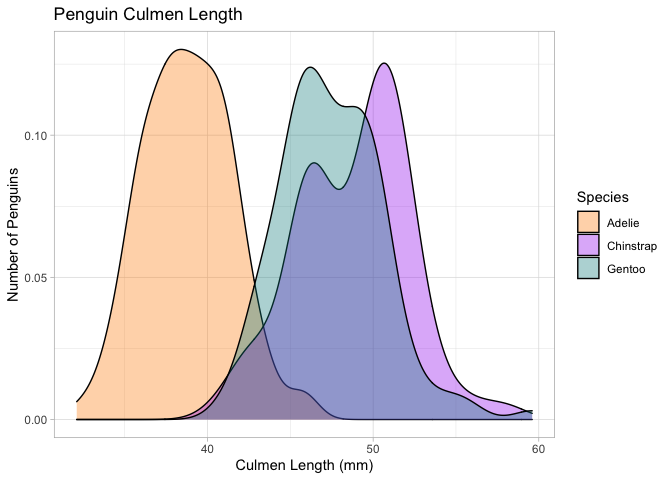
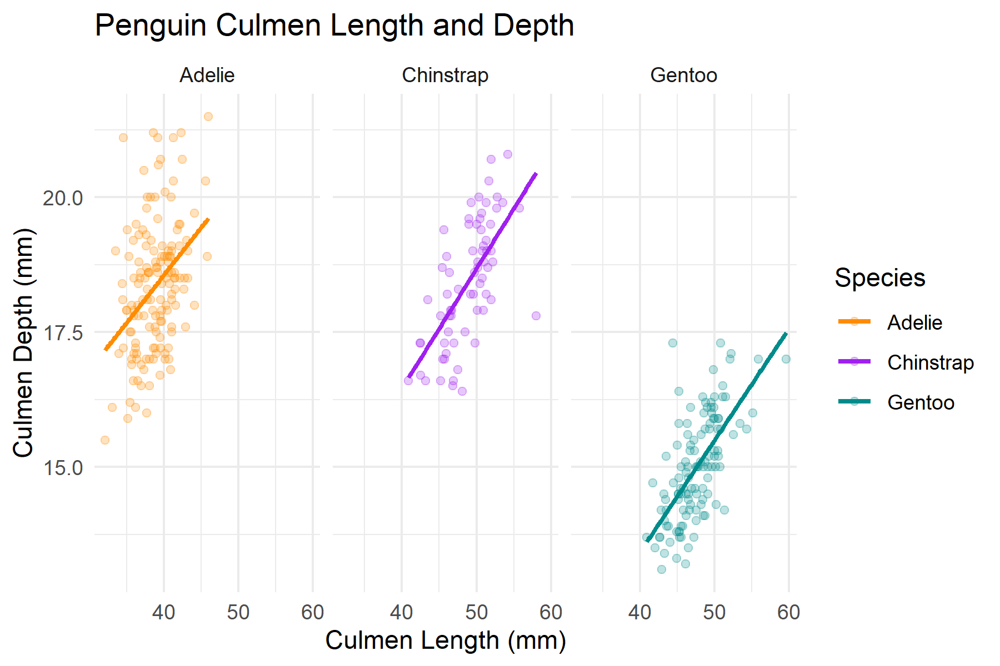
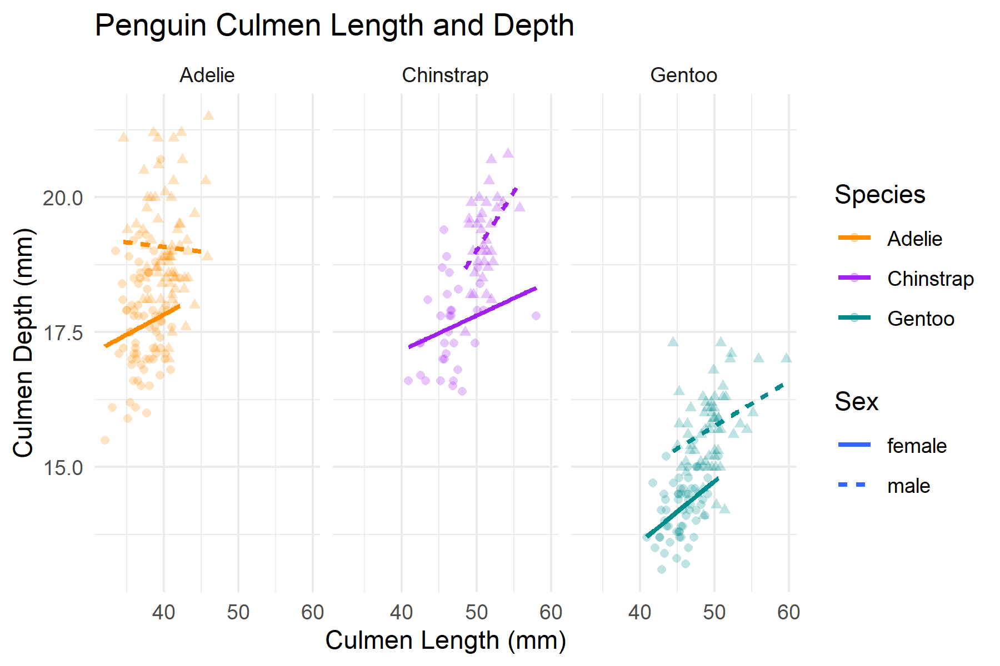
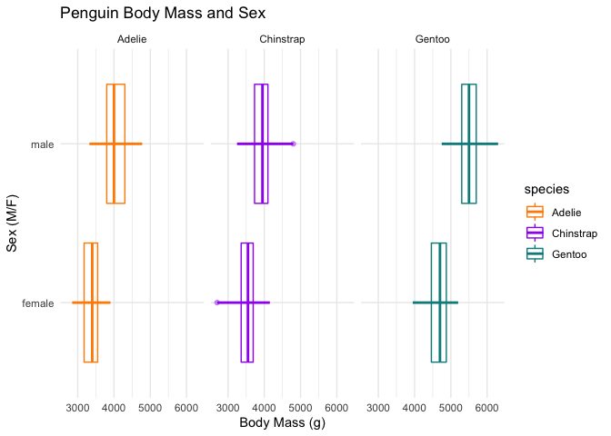

Data Visualization Activity
================
Juan Ramirez

## Visualizing Penguins

For each situation, follow the instructions to create a visualization of
the penguin data.

``` r
data("penguins") #this loads the data from the palmerpenguins package
```

### Bill Length by Species

For each line of code, comment on what that line of code is doing to the
visualization.  
**Hint:** Highlight from before the `%>%` pipe or the `+`to the
beginning of the code sequence and use `Ctrl + Enter` to run just the
highlighted lines of code. Or split the code into multiple code

``` r
penguins %>% 
  drop_na(bill_length_mm) %>% #drops missing values from bill length variable
  ggplot(aes(x = bill_length_mm)) +  #Initialize a plot
  geom_density(aes(fill = species), alpha = 0.35) + #Plot each species' bill length with relation to density
  labs(title = "Penguin Culmen Length", #set plot title
       x = "Culmen Length (mm)", #title for x axis of the plot
       y = "Number of Penguins", #title for y axis of the plot
       fill = "Species") + #each species has a unique fill color
  scale_fill_manual(values = c("darkorange","purple","cyan4")) #manually sets colors for each item in the plot
```

<!-- -->

### Bill Length and Depth for Penguins

For the following code, add to or modify the graph code below in the
following ways:

-   Color the points by species types using the same color values as the
    previous graph for each species.  
-   Add a straight line to model the relationship between bill depth and
    length by species. (Hint, consider “lm” for method)  
-   Make the points more transparent so that the line stands out.  
-   Add appropriate axis labels, legend labs, and titles to the graph.  
-   Change the theme to “minimal”
-   Facet the graph by species
-   Have the figure print as 6 in wide, 4 in height

The final graph should look like



``` r
penguins %>% 
  drop_na() %>% 
  ggplot(aes(color = species, x = bill_length_mm, y = bill_depth_mm)) +
  geom_point(alpha = 0.4) +
  geom_smooth(se = FALSE, method='lm') +
labs(title = "Penguin Culmen Length and Depth",
       x = "Culmen Length (mm)",
       y = "Number of Penguins",
       fill = "Species") + 
  scale_color_manual(values = c("darkorange","purple","cyan4")) + 
  theme_set(theme_minimal()) +
  facet_grid(. ~ species)
```

    `geom_smooth()` using formula 'y ~ x'

<!-- -->

``` r
  ggsave(filename="culmen_depth_juanramirez.png", width=6, height=4)
```

    `geom_smooth()` using formula 'y ~ x'

-   Bonus: Add a different shape and line type for each sex. The final
    should look like



### Body Mass

Create a data visualization of boxplots to compare body mass by species
and sex.

-   Color the boxplots by species (same colors as previous graphs)
-   Add appropriate axis labels, legend labs, and titles to the graph.  
-   Change the theme to “black and white”  
-   Set figure width and height values to get the best aspect ratio for
    the visualization.  
-   Save the created visualization as “body_mass_yourname.png”

``` r
penguins %>% 
  drop_na() %>% 
  ggplot(aes(color = species, x = body_mass_g, y = sex)) +
  geom_boxplot(alpha = 0.4) +
  geom_smooth(se = FALSE, method='lm') +
labs(title = "Penguin Body Mass and Sex",
       x = "Body Mass (g)",
       y = "Sex (M/F)",
       fill = "Species") + 
  scale_color_manual(values = c("darkorange","purple","cyan4")) + 
  theme_set(theme_bw()) +
  facet_grid(. ~ species)
```

    `geom_smooth()` using formula 'y ~ x'

<!-- -->

``` r
  ggsave(filename="body_mass_juanramirez.png", width=6, height=3)
```

    `geom_smooth()` using formula 'y ~ x'

### Flipper Length

Create a visualization (your choice of geometry) to compare flipper
length between species, use the same color choices as before. Bonus,
include a comparison between sex. As always, include appropriate labels
and choose an alternative theme of your choice. Export as
“flipper_length_yourname.jpg”.

``` r
penguins %>% 
  drop_na() %>% 
  ggplot(aes(color = species, x = flipper_length_mm, y = species)) +
  geom_dotplot(alpha = 0.4) +
  geom_smooth(se = FALSE) +
labs(title = "Penguin Flipper Length by Species",
       x = "Flipper Length (mm)",
       y = "Species",
       fill = "Species") + 
  scale_color_manual(values = c("darkorange","purple","cyan4")) + 
  theme_set(theme_bw()) +
  facet_grid(. ~ species)
```

    Bin width defaults to 1/30 of the range of the data. Pick better value with `binwidth`.

    `geom_smooth()` using method = 'loess' and formula 'y ~ x'

<!-- -->

``` r
  ggsave(filename="flipper_length_juanramirez.png")
```

    Saving 7 x 5 in image

    Bin width defaults to 1/30 of the range of the data. Pick better value with `binwidth`.

    `geom_smooth()` using method = 'loess' and formula 'y ~ x'

### Species Location

Create a visualization to demonstrate which islands contain which
species of penguin. As always, include appropriate labels and choose an
alternative theme of your choice. You do not need to export this
graphic.

You can see examples by looking at the graphics labeled `bar1.png`,
`bar2.png`, and `bar3.png` in the project folder, but you are not
limited to these graph geometries and modifiers if you decide to try
something different.

``` r
penguins %>% 
  ggplot(aes(x = island)) + 
  geom_bar(aes(fill = species), alpha = 0.35) +
  labs(title = "Penguins per Species per Island", 
       x = "Islands", 
       y = "Number of Penguins", 
       fill = "Species") + 
  scale_fill_manual(values = c("darkorange","purple","cyan4"))
```

<!-- -->

``` r
  ggsave(filename = "islands_juanramirez.png")
```

    Saving 7 x 5 in image

## Activity Submission

Be sure to submit the updated .Rmd file and knitted version of the file
as well as any images generated or saved as a part of the activity.
Remember you can submit this as zipped file or a GitHub repository. If
you submit as a GitHub repository, change the `ouput:` type to
`github_document` before you knit it so that the knitted file is easily
viewable on your GitHub repository.
